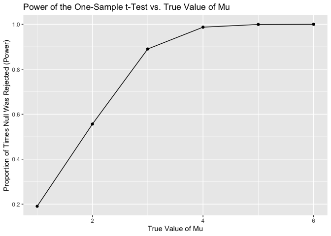
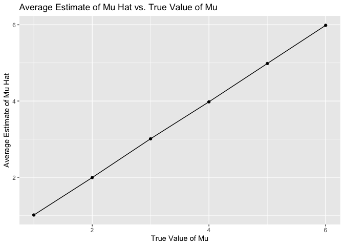
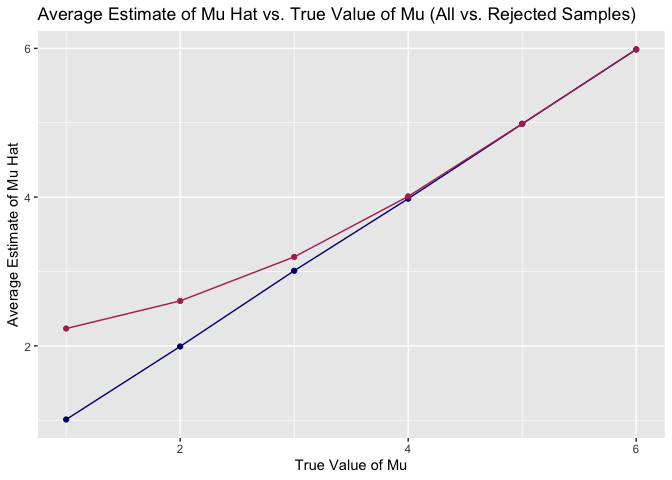
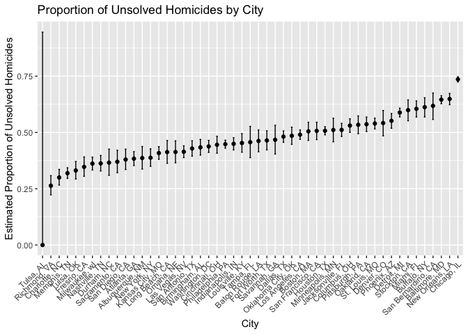

Homework 5
================

# Problem 2

## part a

``` r
n = 30
sigma = 5
mu = 0
alpha = 0.05
num_simulations = 5000
```

``` r
set.seed(123)
```

``` r
sim_results = tibble(simulation = 1:num_simulations) |> 
  mutate(
    data = map(simulation, ~ rnorm(n, mean = mu, sd = sigma)), 
    t_test = map(data, ~ t.test(.x, mu = mu)),
    tidy_results = map(t_test, broom::tidy)
  ) |> 
  unnest(cols = c(tidy_results)) |> 
  select(simulation, estimate, p.value)
```

## partb

``` r
mu_values = c(1, 2, 3, 4, 5, 6)
```

``` r
simulation_results = list()
```

``` r
simulation_results = map(mu_values, function(mu) {
  tibble(simulation = 1:num_simulations) |> 
    mutate(
      mu = mu,
      data_b = map(simulation, ~ rnorm(n, mean = mu, sd = sigma)),
      t_test_b = map(data_b, ~ t.test(.x, mu = 0)),
      tidy_results_b = map(t_test_b, broom::tidy)
    ) |> 
    unnest(cols = c (tidy_results_b)) |> 
    select(simulation, mu, estimate, p.value)
})
```

``` r
simulation_results_df = bind_rows(simulation_results)
```

## part c

``` r
power_results = simulation_results_df |> 
  group_by(mu) |> 
  summarize(
    power = mean(p.value < alpha),
    .group = "drop"
  )
```

``` r
ggplot(power_results, aes(x = mu, y = power)) +
  geom_line() +
  geom_point() +
  labs(
    title = "Power of the One-Sample t-Test vs. True Value of Mu",
    x = "True Value of Mu", 
    y = "Proportion of Times Null Was Rejected (Power)"
  )
```

<!-- -->

## part d

``` r
avg_estimate_results = simulation_results_df |> 
  group_by(mu) |> 
  summarize(
    avg_mu_hat = mean(estimate),
    .group = "drop"
  )
```

``` r
ggplot(avg_estimate_results, aes(x = mu, y = avg_mu_hat)) +
  geom_line() +
  geom_point() +
  labs(
    title = "Average Estimate of Mu Hat vs. True Value of Mu", 
    x = "True Value of Mu", 
    y = "Average Estimate of Mu Hat"
  )
```

<!-- -->

When the value of true mu or the effect is large, the null hypothesis is
more likely to be rejected and the estimate of mu will be closer to the
true value.

## part e

``` r
avg_estimate_rejected = simulation_results_df |> 
  filter(p.value < alpha) |> 
  group_by(mu) |> 
  summarize(
    avg_mu_hat_rejected = mean(estimate), 
    .groups = "drop"
  )
```

``` r
ggplot() +
  geom_line(data = avg_estimate_results, aes(x = mu, y = avg_mu_hat), color = "navy") +
  geom_point(data = avg_estimate_results, aes(x = mu, y = avg_mu_hat), color = "navy") +
  geom_line(data = avg_estimate_rejected, aes(x = mu, y = avg_mu_hat_rejected), color = "maroon") +
  geom_point(data = avg_estimate_rejected, aes(x = mu, y = avg_mu_hat_rejected), color = "maroon") +
  
  labs(
    title = "Average Estimate of Mu Hat vs. True Value of Mu (All vs. Rejected Samples)", 
    x = "True Value of Mu", 
    y = "Average Estimate of Mu Hat"
  ) +
  scale_color_manual(values = c("navy" = "navy", "maroon" = "maroon")) +
  theme(legned.position = "none")
```

<!-- -->

The navy line represents the average estimate of mu hat across all
simulations, which gets closer to the true mu value as the true mu
increases.

The maroon line represents the average estimate of mu hat for only the
simulations where the null hypothesis was rejected. The line gets closer
to the true mu value as the true mu increases.

# Problem 3

The raw data is broken up into multiple features such as case
information, location details, victim information, and case status.
Within case information, the data includes case ID for each homicide
case, date of each incident, and the year the homicide took place. Under
location details, the data include the city, state, and longitude and
latitude of each incident. Within victim information, the data
represents the victim name, age at time of death, gender, and race or
ethnicity. Lastly, within case status, the data shows disposition which
is the status of the case including:

- "Open/No arrest" where no arrest was made and the case is open.   

- "Closed without arrest" where the case is closed, but no arrest was made.   

- "Closed by arrest" wherre the case is closed and an arrest was made.   

There are a few limitations with the data, primarily that the data only
focuses on a select number of cities across the United States which may
not depict an accurate representation of the entire country.

## part a

``` r
homicide_df = read_csv(file = "./data/homicide-data.csv")
```

``` r
homicides = homicide_df |> 
  mutate(city_state = paste(city, state, sep = ", "))
```

``` r
unsolved_dispositions = c("Closed without arrest", "Open/No arrest")
```

``` r
city_summary = homicides |> 
  group_by(city_state) |> 
  summarize(
    total_homicides = n(),
    unsolved_homicides = sum(disposition %in% unsolved_dispositions)
  )
```

## part b

``` r
baltimore = homicides |> 
  filter(city_state == "Baltimore, MD")
```

``` r
baltimore_summary = baltimore |> 
  summarize(
    total_baltimore_homicides = n(),
    unsolved_balitmore_homicides = sum(disposition %in% c("Closed without arrest", "Open/No arrest"))
  )
```

``` r
prop_test = prop.test(
  x = baltimore_summary$unsolved_balitmore_homicides,
  n = baltimore_summary$total_baltimore_homicides,
  conf.level = 0.95
)
```

``` r
tidy_result = broom::tidy(prop_test)
```

``` r
estimated_proportion = tidy_result$estimate
conf_int = tidy_result |> 
  select(conf.low, conf.high)
```

## part c

``` r
city_result = city_summary |> 
  rowwise() |> 
  mutate(
    city_prop_test = purrr::map2(
      unsolved_homicides, total_homicides,
      ~ broom::tidy(prop.test(x = .x, n = .y, conf.level = 0.95
      ))
    )
  ) |> 
  unnest(cols = c(city_prop_test)) |> 
  select(city_state, total_homicides, unsolved_homicides, estimate, conf.low, conf.high)
```

## part d

``` r
city_result |> 
  mutate(
    city_state = fct_reorder(city_state, estimate)
  ) |> 
  ggplot(aes(x = city_state, y = estimate, ymin = conf.low, ymax = conf.high)) +
  geom_point() +
  geom_errorbar(width = 0.2) +
  labs (
    x = "City", 
    y = "Estimated Proportion of Unsolved Homicides", 
    title = "Proportion of Unsolved Homicides by City"
  ) +
  theme(axis.text.x = element_text(angle = 45, hjust = 1))
```

<!-- -->
